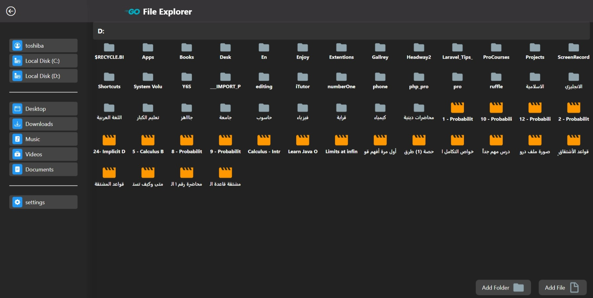
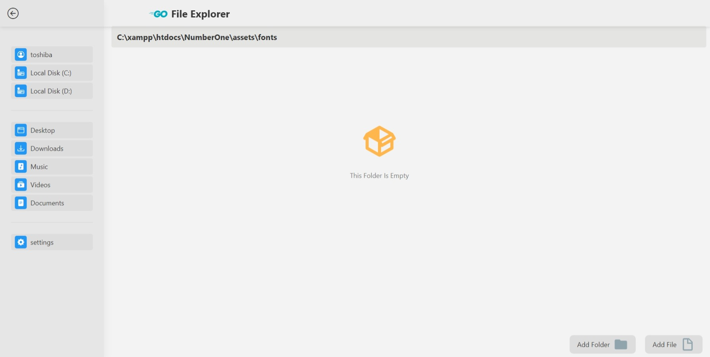
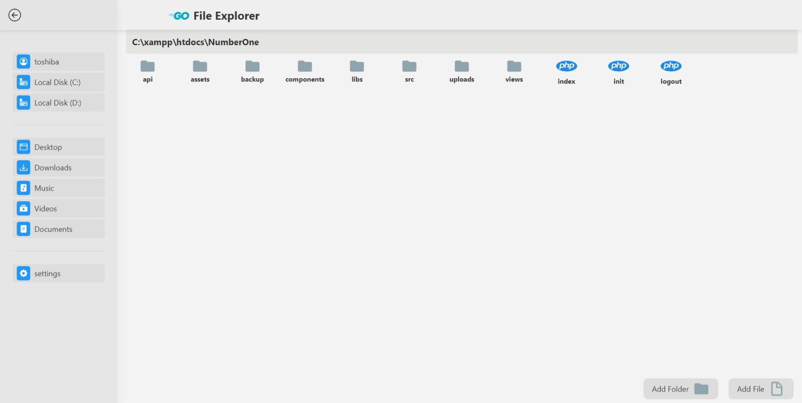
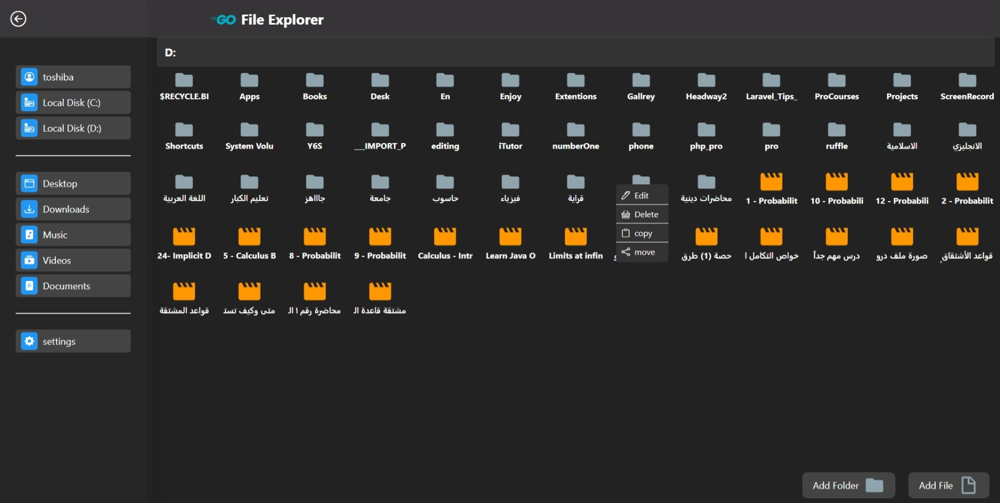
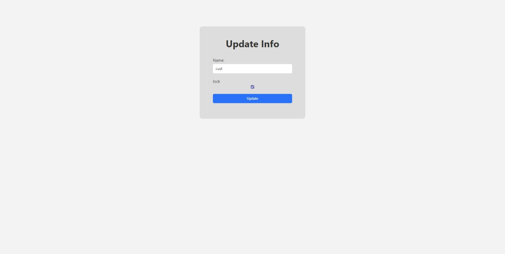
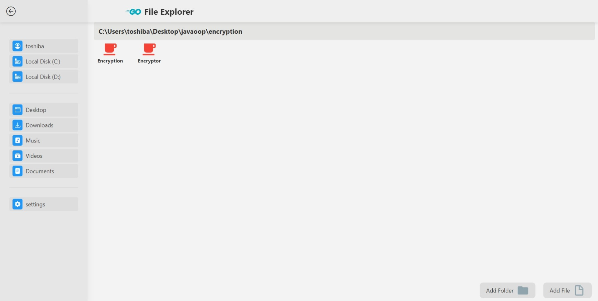
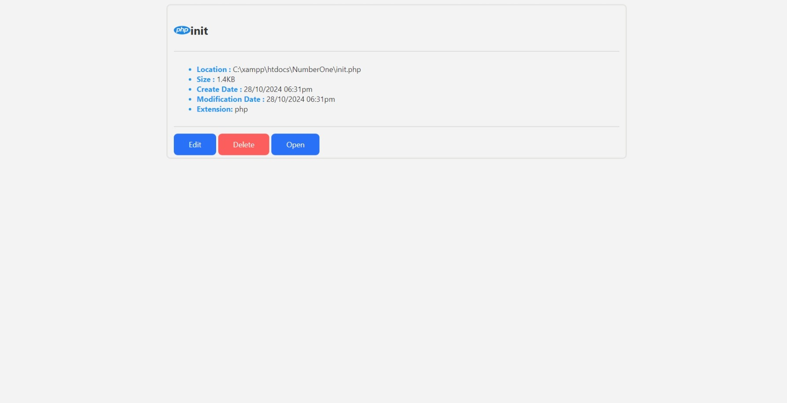

# Hello there ✋🏼

it is **Go File Explorer** on web, a simple, small and lightwight file explorer ✨.

## ✨ Features :

- Simple UI.
- Explore all files and directories on the server.
- Create, copy, move, update and delete files and directories.
- dark mode and various fonts.
- Files lock with password (on develop).

---

## 👨🏼‍💻 Technologies :

- html
- css
- javascript
- php

## Overview :

---

#### I know it is not big project, but it is big for my ❤
